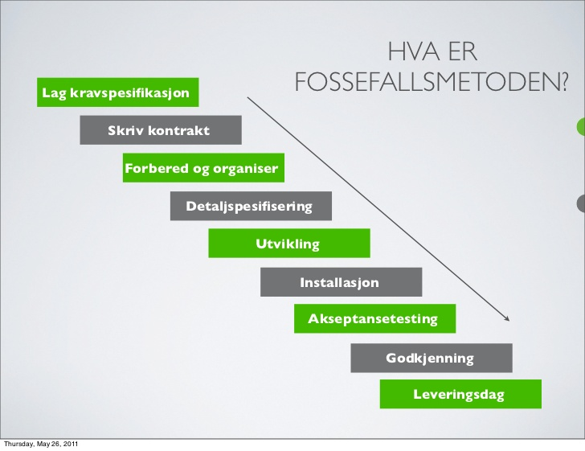

# Section title

Paragraphs are separated by a blank line.

2nd paragraph. *Italic*, **bold**, and `monospace`. Itemized lists
look like:

  * this one
  * that one
  * the other one

Note that --- not considering the asterisk --- the actual text
content starts at 4-columns in.

> Block quotes are
> written like so.
>
> They can span multiple paragraphs,
> if you like.

Use 3 dashes for an em-dash. Use 2 dashes for ranges (ex., "it's all
in chapters 12--14"). Three dots ... will be converted to an ellipsis.

## Subsection title

Here's a numbered list:

 1. first item
 2. second item
 3. third item

Note again how the actual text starts at 4 columns in (4 characters
from the left side). Here's a code sample:

    # Let me re-iterate ...
    for i in 1 .. 10 { do-something(i) }

As you probably guessed, indented 4 spaces. By the way, instead of
indenting the block, you can use delimited blocks, if you like:

~~~
define foobar() {
    print "Welcome to flavor country!";
}
~~~

(which makes copying & pasting easier). You can optionally mark the
delimited block for Pandoc to syntax highlight it:

~~~python
import time
# Quick, count to ten!
for i in range(10):
    # (but not *too* quick)
    time.sleep(0.5)
    print(i)
~~~

### Sub-Subsection title

Now a nested list:

 1. First, get these ingredients:

      * carrots
      * celery
      * lentils

 2. Boil some water.

 3. Dump everything in the pot and follow
    this algorithm:

        find wooden spoon
        uncover pot
        stir
        cover pot
        balance wooden spoon precariously on pot handle
        wait 10 minutes
        goto first step (or shut off burner when done)

    Do not bump wooden spoon or it will fall.

Notice again how text always lines up on 4-space indents (including
that last line which continues item 3 above).

Here's a link to [a website](http://foo.bar), to a [local
doc](local-doc.html), and to a [section heading in the current
doc](#an-h2-header). Here's a footnote [^1]. Here's a link to a small author
(@small), and here's a link to a big one (@big).

[^1]: Some footnote text.

# Another section title

Tables can look like this:

Name           Size  Material      Color
------------- -----  ------------  ------------
All Business      9  leather       brown
Roundabout       10  hemp canvas   natural
Cinderella       11  glass         transparent

Table: Shoes sizes, materials, and colors.

(The above is the caption for the table.) Pandoc also supports
multi-line tables:

--------  -----------------------
Keyword   Text
--------  -----------------------
red       Sunsets, apples, and
          other red or reddish
          things.

green     Leaves, grass, frogs
          and other things it's
          not easy being.
--------  -----------------------

A horizontal rule follows.

------

Here's a definition list:

apples
  : Good for making applesauce.

oranges
  : Citrus!

tomatoes
  : There's no "e" in tomatoe.

Again, text is indented 4 spaces. (Put a blank line between each
term and  its definition to spread things out more.)

Here's a "line block" (note how whitespace is honored):

| Line one
|   Line too
| Line tree

and images can be specified like so:

{#fig:foss width=70%}

Inline math equation: $\omega = d\phi / dt$. Display
math should get its own line like so:

$$I = \int \rho R^{2} dV$$

And note that you can backslash-escape any punctuation characters
which you wish to be displayed literally, ex.: \`foo\`, \*bar\*, etc.

And you can reference images as @fig:foss.

\clearpage

